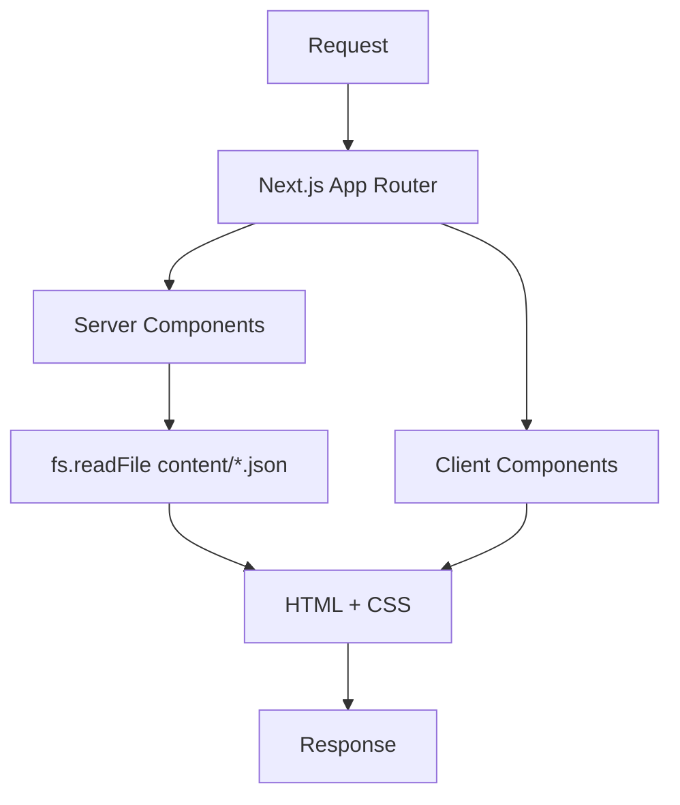
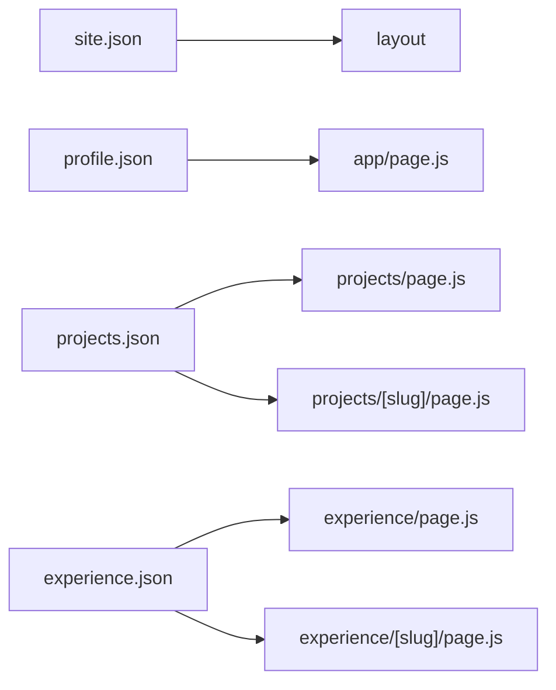

### Architecture

This project is a JSON‑driven portfolio built on the Next.js App Router. Server components read JSON from `content/` to render pages. Dynamic routes are statically generated via `generateStaticParams`. Client components handle interactivity (navbar menu, theme toggle).

#### High-level flow

- `src/app/layout.js` reads `content/site.json` to generate metadata and wraps pages with `Navbar` and `Footer`.
- Pages like `src/app/page.js`, `src/app/projects/page.js`, and `src/app/experience/page.js` read JSON content on the server.
- Dynamic routes `projects/[slug]` and `experience/[slug]` use `generateStaticParams` to prebuild detail pages.
- `Navbar` is a server component that fetches site config and renders `NavbarClient` for interactivity.

#### Data model entry points

#### Styling and theming
Tailwind is configured with `darkMode: 'class'` and a small `brand` color palette. See `docs/theming-and-ui.md`.

#### Utilities
- `lib/slugify.js` – converts titles to URL-friendly slugs
- `lib/dateFormat.js` – format dates for UI 