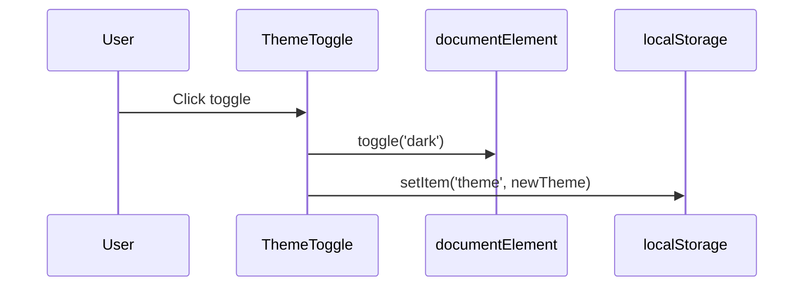

### Theming and UI

#### Tailwind setup
- Config at `tailwind.config.js`
- `darkMode: 'class'` for explicit toggling
- Content includes `src/app/**/*.{js,jsx}` and `src/components/**/*.{js,jsx}`
- Typography plugin enabled

```js
// tailwind.config.js (excerpt)
module.exports = {
  darkMode: 'class',
  theme: {
    extend: {
      colors: {
        brand: {
          50: '#eef2ff', 100: '#e0e7ff', 200: '#c7d2fe', 300: '#a5b4fc',
          400: '#818cf8', 500: '#6366f1', 600: '#4f46e5', 700: '#4338ca',
          800: '#3730a3', 900: '#312e81'
        }
      }
    }
  },
  plugins: [require('@tailwindcss/typography')]
}
```

#### Dark mode
- Implemented via `ThemeToggle` client component
- Persists to `localStorage` and toggles `document.documentElement.classList`



#### Components
- `Navbar` (server) + `NavbarClient` (client): responsive navigation, menu animation via `framer-motion`, theme toggle placement differs for desktop/mobile.
- `Footer`: simple site footer.
- `Image` on home page uses Next.js `Image` for avatar.

#### CSS entry
- `src/styles/global.css` includes `@tailwind base; components; utilities;` and disables horizontal overflow. 